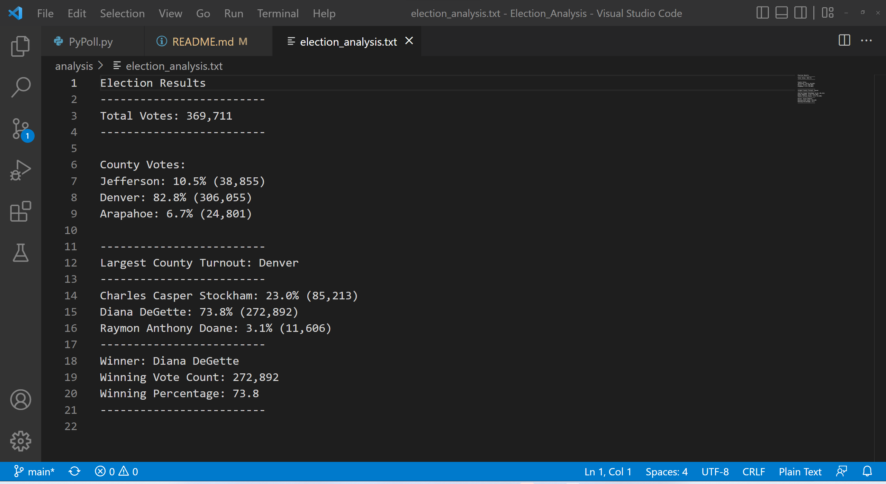

# Election Analysis

## Overview

The purpose of this project is to write a Python script that summarizes election results based on comma-separated value (CSV) data, prints an analysis of the data to the terminal, and saves the analysis to a file. The analysis includes the following:

- Total votes cast.
- Turnout and turnout percentage by county.
- Highest turnout county.
- Votes and vote percentages for each candidate.
- Winning candidate with votes and percentage.

## Election Audit Results

- A total of 369,711 votes were cast in this election.
- Denver County had 306,055 votes cast (82.8% of all votes), Jefferson had 38,855 votes cast (10.5% of all votes cast), and Arapahoe had 24,801 (6.7%).
- Denver County had the highest turnout of all counties.
- Diana Degette received 272,892 votes (73.8%), Charles Casper Stockham received 85,213 votes (23.0%), and Raymon Anthony Doane received 11,606 votes (3.1%).
- Diana Degette won the election, with 272,892 votes out of 369,711 total votes, or 73.8% of the total.

## Summary

This script is ready to be used with any election involving multiple candidates using results in the same CSV format. For elections that are more complicated than a winner-take-all result, small modifications to the script should suffice for the election. However, in a case in which more than one candidate can win an election, the script can be modified to announce more than one winner. In cases in which an election eliminates the lowest ranked candidate or candidates, the script can be modified to show the candidate or candidates that were not eliminated.
